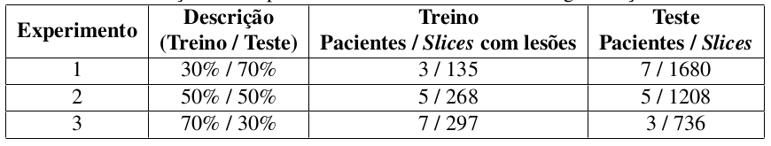
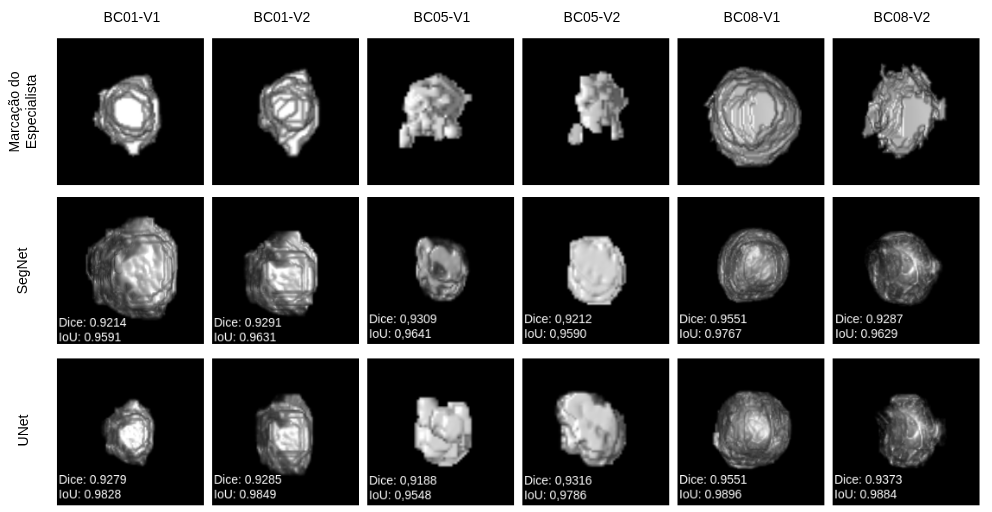

#  🔍 Segmentação de Tumores em Imagens Médicas com Deep Learning

Este repositório contém implementações e experimentos inspirados nos métodos descritos nas publicações listadas abaixo, com foco em segmentação de tumores em imagens DCE-MRI da mama utilizando Deep Learning.

🔹 **SegNet**

A **SegNet** é uma arquitetura de rede neural convolucional voltada para **segmentação semântica**, composta por um **encoder–decoder simétrico**. O encoder é responsável pela extração de características por meio de camadas de convolução, normalização e pooling. Durante o processo de downsampling, a SegNet **armazena os índices de max-pooling**, que são posteriormente reutilizados no decoder para realizar o upsampling de forma eficiente.

Essa estratégia reduz significativamente o uso de memória e preserva informações espaciais relevantes, tornando a SegNet adequada para **segmentação de tumores em imagens médicas**, onde a delimitação precisa das bordas é essencial. No contexto deste projeto, a SegNet foi empregada para segmentar automaticamente regiões tumorais em imagens **DCE-MRI**, apresentando alto desempenho e boa generalização.

   
  <em>Arquitetura SegNet utilizada na segmentação.</em>

🔹 **UNet**

A **UNet** é uma arquitetura amplamente utilizada em **segmentação de imagens biomédicas**, caracterizada por sua estrutura em forma de “U”. Ela combina um **caminho de contração (encoder)**, responsável pela captura de contexto e características de alto nível, com um **caminho de expansão (decoder)**, que recupera a resolução espacial da imagem.

Um diferencial da UNet é o uso de **skip connections**, que conectam diretamente camadas correspondentes do encoder ao decoder, permitindo a fusão de informações espaciais detalhadas com características semânticas profundas. Essa estratégia melhora a precisão da segmentação, especialmente em regiões com bordas complexas e contraste variável. No projeto, a UNet foi utilizada para segmentação de tumores em **DCE-MRI**, alcançando métricas elevadas e resultados consistentes.

   
  <em>Arquitetura UNet utilizada na segmentação.</em>

## Avaliação das Arquiteturas UNet e SegNet

Para avaliar a eficiência das arquiteturas **UNet** e **SegNet** na segmentação de tumores em imagens **DCE-MRI da mama**, foram realizados três experimentos com diferentes proporções de dados para **treinamento e teste**. Os cenários consideraram variações no número de pacientes e de *slices* com lesões, permitindo analisar o impacto do volume de dados no desempenho dos modelos.

Os experimentos foram configurados com divisões de **30/70**, **50/50** e **70/30** (treino/teste), garantindo uma avaliação comparativa e robusta das arquiteturas em diferentes condições de aprendizado e generalização, conforme descrito na imagem a seguir.

   
  <em>Descrição dos experimentos realizados durante a segmentação do tumor.</em>

## Resultados da Segmentação Tumoral

A figura a seguir apresenta exemplos de segmentação do tumor em imagens **DCE-MRI da mama**, comparando os resultados obtidos pelas arquiteturas **SegNet** e **UNet** nos três experimentos realizados. São mostradas a imagem original, a **região de interesse (ROI)** definida pelo especialista e as máscaras segmentadas em cada cenário experimental.

   
  <em>Exemplos finais de segmentação usando arquitetura SegNet e UNet.</em>

Os resultados evidenciam o impacto das diferentes proporções de dados de treinamento na qualidade da segmentação, bem como as diferenças de comportamento entre as arquiteturas, especialmente na preservação da forma e na delimitação das bordas do tumor.

## Análise Volumétrica e Avaliação da Segmentação

A figura a seguir apresenta a comparação entre a **marcação manual do especialista** e as segmentações automáticas geradas pelas arquiteturas **SegNet** e **UNet** em diferentes casos clínicos e volumes temporais (V1 e V2). Para cada reconstrução volumétrica, são reportadas as métricas **Dice** e **IoU**, evidenciando a alta concordância entre as segmentações automáticas e a referência manual.

   
  <em>Volumes da marcação do especialista e segmentados com as arquitetura SegNet e UNet.</em>

Os resultados demonstram a consistência das arquiteturas na segmentação tridimensional do tumor, bem como sua capacidade de preservar forma e volume ao longo da análise temporal.

## Publicações Relacionadas

Este projeto está relacionado às seguintes publicações científicas na área de segmentação e análise de tumores em imagens de DCE-MRI da mama:

- **Tumor Segmentation in Breast DCE-MRI Slice Using Deep Learning Methods**  
  *IEEE International Symposium on Computers and Communications (ISCC), 2021*  
  DOI: https://doi.org/10.1109/ISCC53001.2021.9631444  
  🔗 https://ieeexplore.ieee.org/document/9631444

- **Deep learning-based tumor segmentation and classification in breast MRI with 3TP method**  
  *Biomedical Signal Processing and Control, 2024*  
  DOI: https://doi.org/10.1016/j.bspc.2024.106199

- **An approach to the prediction of breast cancer response to neoadjuvant chemotherapy based on tumor habitats in DCE-MRI images**  
  *Expert Systems with Applications, 2023*  
  DOI: https://doi.org/10.1016/j.eswa.2023.121081

