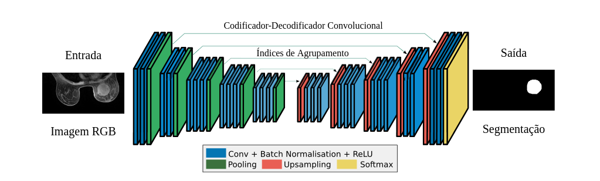
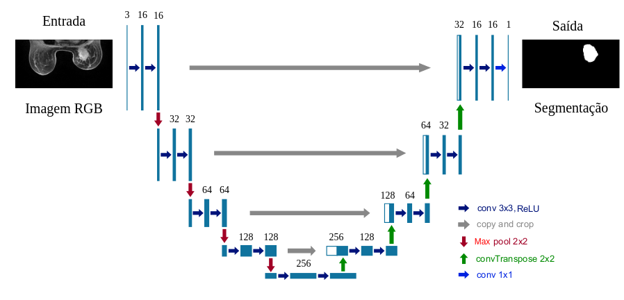

#  🔍 Segmentação de Tumores em Imagens Médicas com Deep Learning

Este repositório apresenta metodos computacionais automaticos para segmentação de tumores mamários em imagens de Ressonância Magnética com Contraste Dinâmico (DCE-MRI). A segmentação automática do tumor utiliza Redes Neurais Convolucionais (CNNs), especificamente as arquiteturas UNet e SegNet. 

🔹 **SegNet**

A **SegNet** é uma arquitetura de rede neural convolucional voltada para **segmentação semântica**, composta por um **encoder–decoder simétrico**. O encoder é responsável pela extração de características por meio de camadas de convolução, normalização e pooling. Durante o processo de downsampling, a SegNet **armazena os índices de max-pooling**, que são posteriormente reutilizados no decoder para realizar o upsampling de forma eficiente.

Essa estratégia reduz significativamente o uso de memória e preserva informações espaciais relevantes, tornando a SegNet adequada para **segmentação de tumores em imagens médicas**, onde a delimitação precisa das bordas é essencial. No contexto deste projeto, a SegNet foi empregada para segmentar automaticamente regiões tumorais em imagens **DCE-MRI**, apresentando alto desempenho e boa generalização.

   
  <em>Arquitetura SegNet utilizada na segmentação.</em>

🔹 **UNet**

A **UNet** é uma arquitetura amplamente utilizada em **segmentação de imagens biomédicas**, caracterizada por sua estrutura em forma de “U”. Ela combina um **caminho de contração (encoder)**, responsável pela captura de contexto e características de alto nível, com um **caminho de expansão (decoder)**, que recupera a resolução espacial da imagem.

Um diferencial da UNet é o uso de **skip connections**, que conectam diretamente camadas correspondentes do encoder ao decoder, permitindo a fusão de informações espaciais detalhadas com características semânticas profundas. Essa estratégia melhora a precisão da segmentação, especialmente em regiões com bordas complexas e contraste variável. No projeto, a UNet foi utilizada para segmentação de tumores em **DCE-MRI**, alcançando métricas elevadas e resultados consistentes.

   
  <em>Arquitetura UNet utilizada na segmentação.</em>

